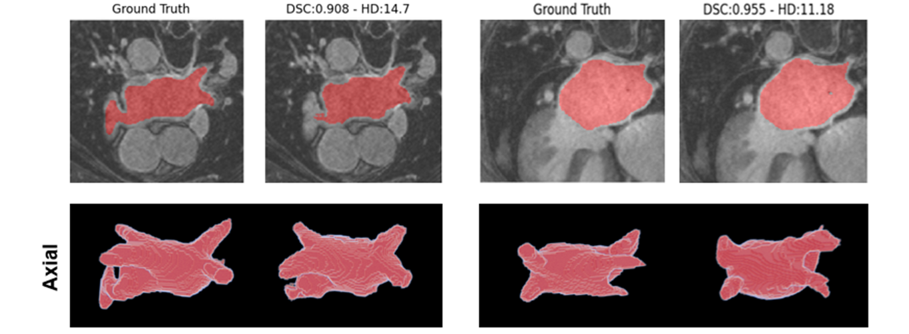

# Automatic Segmentation the Left Atrium from Late Gadolinium Enhancement 3D Magnetic Resonance Images

This is a Master Thesis Project conducted in the master degree of Artificial Intelligence (UPC, UB and URV) in collaboration with the Department of Arrhythmias from the Hospital Clínic de Barcelona. 

The main objective is to build a fully-automated architecture for the segmentation of the left atrium from Late Gadolinium Enhancement 3D MRI data. 
The model is a patch-based Unet architecture with region-based and contour-based losses. This code has been implemented using pytorch and inspired by the 3D Unet 
neural network by Özgün Çiçek et al. in the [3D U-Net: Learning Dense Volumetric Segmentation from Sparse Annotation](https://arxiv.org/abs/1606.06650), and the boundary loss proposed by Kerdevec et al. in the 
[Boundary loss for highly unbalanced segmentation](https://arxiv.org/pdf/1812.07032.pdf). 

# ClínicLA dataset
The cardiac 3D LGE-MRI dataset used for this study belong to the Department of Arrhythmias of the Hospital Clínic de Barcelona. 
Images were collected for the study performed in the [Delayed  GadoliniumEnhancement Magnetic Resonance Imaging Detected Anatomic Gap Length in Wide Circumferential Pulmonary Vein Ablation Lesions Is Associated With Recurrence of Atrial Fibrillation](https://pubmed.ncbi.nlm.nih.gov/30562102/) 
and extended with other images obtained during clincal practice of ablation procedures.

The  dataset  consist  of  chest  view  LGE-MRI  images  from patients undergoing cardiac ablation procedures. The dataset cannot be shared due to legal and ethical concerns.  
git log origin/master..HEAD
# Train and evaluate the model

The "main.py" file contains the parser of parameters to train or evaluate the model. 

### Train 
For training change the "is_load" parameter to False and set the desired hyper-parameters.
The actual configuration is with the best combination of parameters after fine-tuning. 
Finally, run the "main.py" file. 

### Evaluate
For evaluation change the "is_load" parameter to True and add the model checkpoints path 
into the "load_path" argument. Finally, run the "main.py" file. 

